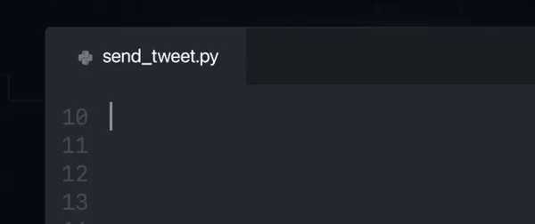
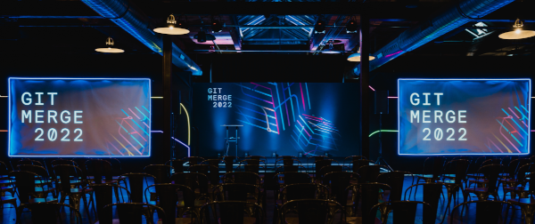
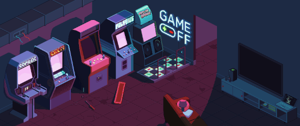
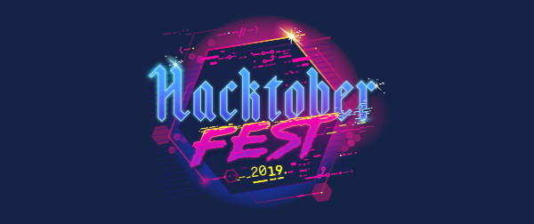
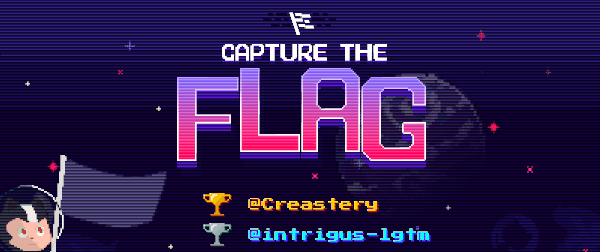
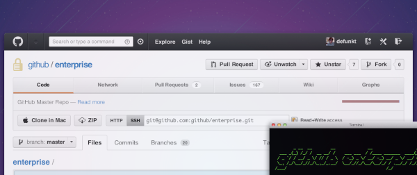

## 👋🏻 Hey, I’m Lee

Program Manager, Engineer, Developer Advocate, marketer, and experimenter working at the edge of AI-assisted software development at GitHub.

I’ve been at GitHub since 2011, wearing many hats (and still collecting more). I work at the intersection of engineering, product, developer relations, and community... building tools and bringing developers together through programs, events, and experiments.

Currently exploring what software development looks like in the age of AI - shipping projects, organizing events like Git Merge, GitHub Universe, Game Off, and helping create the spaces where developers thrive. Focused on  ███ ██ and ██ ██ ███████ rn.

Honestly, it’s kind of a dream job.

## Top 10 ships

<table>
  <tr>
    <td width="50%"> <strong>Website:</strong> GitHub Skyline
    <td width="50%"> <strong>Product launch:</strong> GitHub CLI 1.0</td>
  </tr>
  <tr>
    <td width="50%"> <strong>Product launch:</strong> GitHub Copilot
    <td width="50%"> <strong>Event organizer:</strong> Git Merge 2022</td>
  </tr>
  <tr>
    <td width="50%"> <strong>Game Jam:</strong> Game Off organizer + creative</td>
    <td width="50%"> <strong>Hackathon:</strong> Hacktoberfest co-organizer</td>
  </tr>
  <tr>
    <td width="50%"> <strong>Video:</strong> NASA JPL</td>
    <td width="50%"> <strong>Creative:</strong> GitHub CTF</td>
  </tr>
  <tr>
    <td width="50%"> <strong>Video:</strong> Epic Games & Unreal Engine on the 'Hub</td>
    <td width="50%"> <strong>Engineer:</strong> GitHub Enterprise</td>
  </tr>
</table>

## Featured personal open source projects

### iOS Apps

- **[GitHub Status Monitor](https://github.com/leereilly/github-status-ios)** – a native iOS app for monitoring and alerting on GitHub infrastructure in real time 🟢 🟡 🔴

### macOS apps

- **[GitHub Status Bar]()** – View GitHub activity directly from the macOS menu bar.

### GitHub CLI extensions

- **[GitHub Changelog](https://github.com/leereilly/gh-changelog)** - View the latest GitHub Changelog entries directly in your terminal.
- **[GitHub Dungeons](https://github.com/leereilly/gh-dungeons)** – A GitHub-themed dungeon crawler built during a game jam.
- **[GitHub Yule Log](https://github.com/leereilly/gh-yule-log)** – A Yule log extension for GitHub CLI. ̶Y̶u̶l̶e̶ You'll love it! 🪵 🔥

### Chrome extensions

- **[GitHub Issues Focus]()** – Stay focused on the issues that matter most.

### CLI apps

- **[Graphsay](https://github.com/leereilly/graphsay)** - Like `cowsay`, but for generating animated messages in GitHub contribution graphs to export as SVG, GIF, WebP, or MP4.

### Windows apps

- **[MTGA Fullscreen Helper](https://github.com/leereilly/MTGAFullscreenHelper)** – A Windows tray application that automatically keeps Magic: The Gathering Arena in fullscreen mode on ultrawide displays

### Web apps

- **[Dev Tartan](https://github.com/leereilly/dev-tartan)** - Generates a unique, deterministic tartan pattern from any GitHub username. 

### Silly hackathon entries

- **[GitHub Firehose](https://github.com/leereilly/gh-firehose)** – A terminal-based visualization of real-time GitHub push events displayed on a rotating ASCII globe.

### Silly ame jam entries

- **[GitHub Pong 3D](https://github.com/leereilly/3dpingpong)** - A 3D pong game themed after the GitHub contribution graph, with webcam eyebrow-tracking controls. Built for a "Fork Off" challange.
- **[GOTO Town](https://github.com/leereilly/goto-town)** - A ridiculous web game controlled with your eyes, brows, and bawls built for Jerbob's Silly Jam 2026.
- **[PIXEL DUEL](https://github.com/leereilly/PIXEL-DUEL)** - A dueling pixel game built for Ludum Dare 38.
- **[SN@KELIKE](https://github.com/leereilly/snakelike)** - A Snake x Roguelike mashup built for 7DRL 2026.

## Recent GitHub Blog posts:

<!--START_SECTION:feed-->
* [Register now for OpenClaw: After Hours @ GitHub](https:&#x2F;&#x2F;github.blog&#x2F;open-source&#x2F;register-now-for-openclaw-after-hours-github&#x2F;)
* [Light waves, rising tides, and drifting ships: Game Off 2025 winners](https:&#x2F;&#x2F;github.blog&#x2F;open-source&#x2F;gaming&#x2F;light-waves-rising-tides-and-drifting-ships-game-off-2025-winners&#x2F;)
* [This year’s most influential open source projects](https:&#x2F;&#x2F;github.blog&#x2F;open-source&#x2F;maintainers&#x2F;this-years-most-influential-open-source-projects&#x2F;)
* [GitHub Game Off 2025 theme announcement](https:&#x2F;&#x2F;github.blog&#x2F;company&#x2F;github-game-off-2025-theme-announcement&#x2F;)
* [From karaoke terminals to AI résumés: The winners of GitHub’s For the Love of Code challenge](https:&#x2F;&#x2F;github.blog&#x2F;open-source&#x2F;from-karaoke-terminals-to-ai-resumes-the-winners-of-githubs-for-the-love-of-code-challenge&#x2F;)
<!--END_SECTION:feed-->

## Recent publications:

Well, not exactly "recent", but these are from my former life working in bioinformatics.

- 🦠 [Los Alamos hepatitis C virus sequence and human immunology databases: an expanding resource for antiviral research](https://pubmed.ncbi.nlm.nih.gov/17626595/)
- 🧬 [The complete genome sequence of Bacillus thuringiensis Al Hakam](https://pubmed.ncbi.nlm.nih.gov/17337577/)
- 🔬 [Pathogenomic sequence analysis of Bacillus cereus and Bacillus thuringiensis isolates closely related to Bacillus anthracis](https://pubmed.ncbi.nlm.nih.gov/16621833/)*

* try saying <em>that</em> ten times fast!

