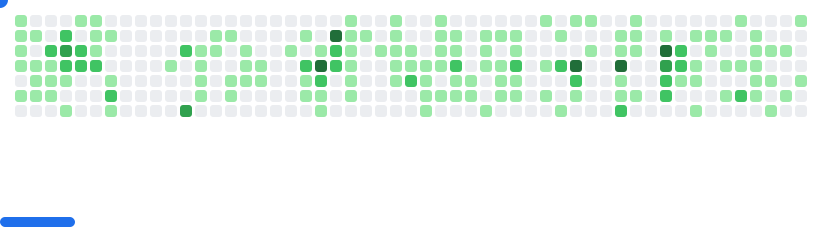

👋🏻 I'm Lee - a <strike>software engineer</strike> manager and <em>writer</em> of programs on GitHub's Developer Relations team. I work on all sorts of fun stuff like ███ ██ and ██ ██ ███████.

#### Favorite ships:

<table>
  <tr>
    <td width="50%"> <strong>Website:</strong> GitHub Skyline
    <td width="50%"> <strong>Product launch:</strong> GitHub CLI 1.0</td>
  </tr>
  <tr>
    <td width="50%"> <strong>Product launch:</strong> GitHub Copilot
    <td width="50%"> <strong>Event organizer:</strong> Git Merge 2022</td>
  </tr>
  <tr>
    <td width="50%"> <strong>Game Jam:</strong> Game Off organizer + creative</td>
    <td width="50%"> <strong>Hackathon:</strong> Hacktoberfest co-organizer</td>
  </tr>
  <tr>
    <td width="50%"> <strong>Video:</strong> NASA JPL</td>
    <td width="50%"> <strong>Creative:</strong> GitHub CTF</td>
  </tr>
  <tr>
    <td width="50%"> <strong>Video:</strong> Epic Games & Unreal Engine on the 'Hub</td>
    <td width="50%"> <strong>Engineer:</strong> GitHub Enterprise</td>
  </tr>
</table>

#

#### Recent GitHub Blog posts:

My job has literally nothing to do with video games or game development. That said, there's a good chance the list of blog posts below will have something to with games. Consider it a hobby!

<!--START_SECTION:feed-->
* [For the Love of Code: a summer hackathon for joyful, ridiculous, and wildly creative projects](https:&#x2F;&#x2F;github.blog&#x2F;open-source&#x2F;for-the-love-of-code-2025&#x2F;)
* [Shine a spotlight on your open source project](https:&#x2F;&#x2F;github.blog&#x2F;open-source&#x2F;shine-a-spotlight-on-your-open-source-project&#x2F;)
* [Game Off 2024 winners](https:&#x2F;&#x2F;github.blog&#x2F;open-source&#x2F;game-off-2024-winners&#x2F;)
* [Game Off 2024 theme announcement](https:&#x2F;&#x2F;github.blog&#x2F;open-source&#x2F;game-off-2024-theme-announcement&#x2F;)
* [Celebrating the GitHub Awards 2024 recipients 🎉](https:&#x2F;&#x2F;github.blog&#x2F;news-insights&#x2F;company-news&#x2F;celebrating-the-github-awards-2024-recipients&#x2F;)
<!--END_SECTION:feed-->

#### Recent publications:

Well, not exactly "recent", but these are from my former life working in bioinformatics.

- 🦠 [Los Alamos hepatitis C virus sequence and human immunology databases: an expanding resource for antiviral research](https://pubmed.ncbi.nlm.nih.gov/17626595/)
- 🧬 [The complete genome sequence of Bacillus thuringiensis Al Hakam](https://pubmed.ncbi.nlm.nih.gov/17337577/)
- 🔬 [Pathogenomic sequence analysis of Bacillus cereus and Bacillus thuringiensis isolates closely related to Bacillus anthracis](https://pubmed.ncbi.nlm.nih.gov/16621833/)*

* try saying <em>that</em> ten times fast!

<picture>
  <source
    media="(prefers-color-scheme: dark)"
    srcset="images/breakout-dark.svg"
  />
  <source
    media="(prefers-color-scheme: light)"
    srcset="images/breakout-light.svg"
  />
  
</picture>
